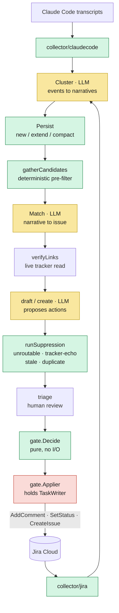
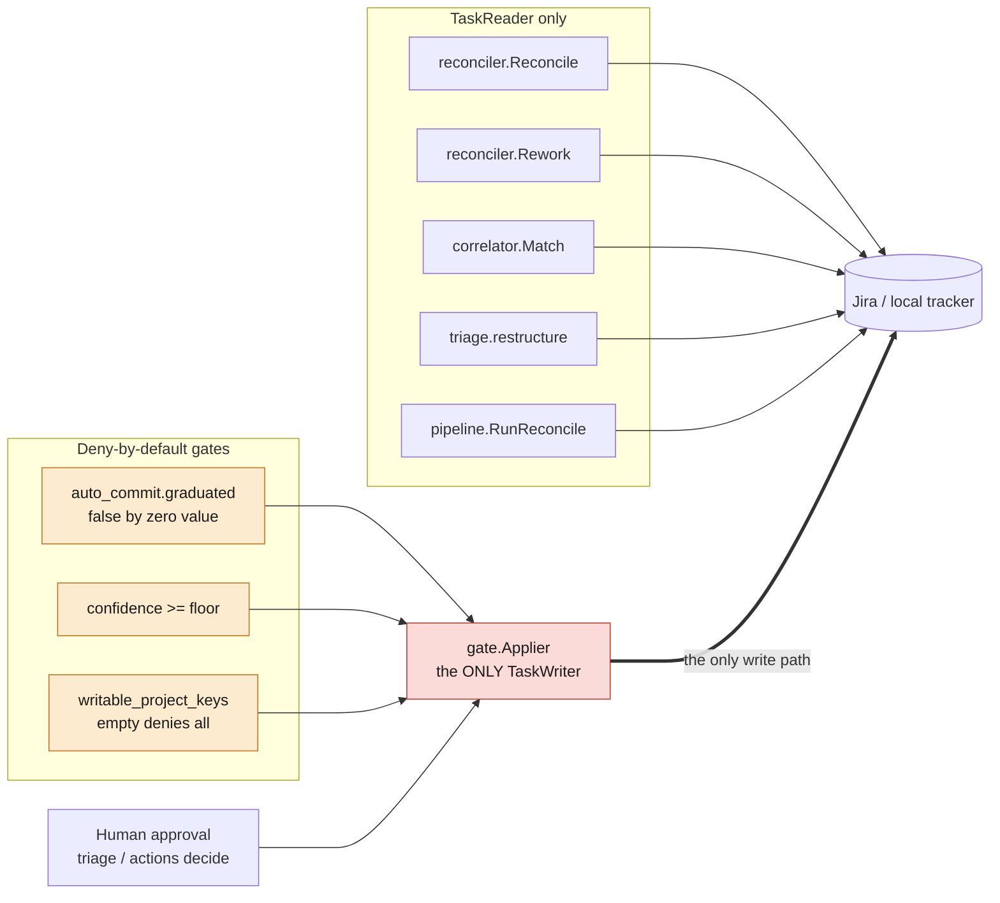
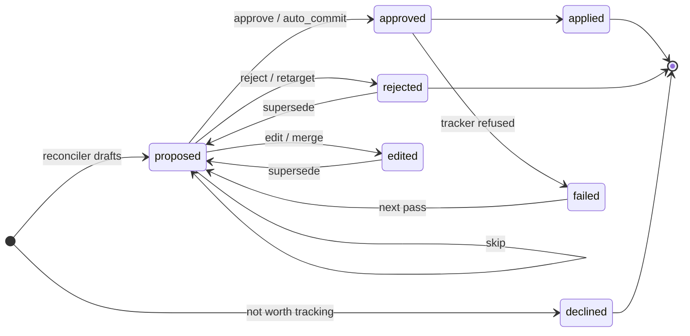
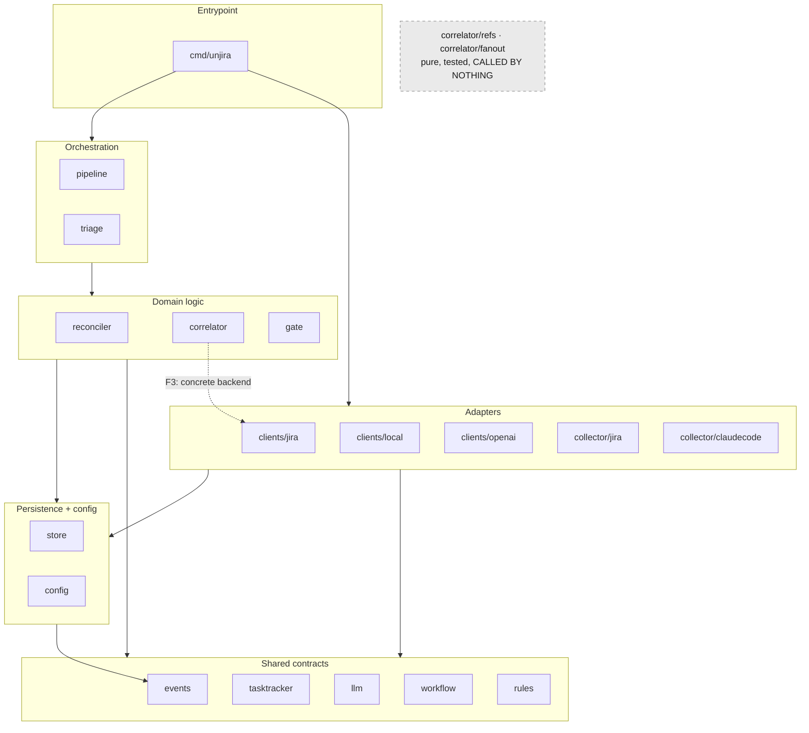

# unjira's architecture, as built

**Scanned 2026-09-02**, at the close of phase 1 and before the distiller.

This file is a **living doc**, held to the same standard as `README.md` and `docs/design-notes.md`:
if a PR changes the pipeline's shape, a package boundary, the write-authority graph, or the action
lifecycle, it updates the relevant diagram *in that PR*. A diagram that has drifted is worse than no
diagram, because it is trusted.

Companion docs, none of which this duplicates:

- `README.md` — what unjira does and the locked design decisions.
- `docs/design-notes.md` — *why* it is shaped this way, as numbered incidents.
- `docs/go-conventions.md` — how the Go is written.
- `CLAUDE.md` — the architecture invariants, stated as rules.

Every claim below was verified against the tree at scan time; findings carry `file:line`.

---

## 1. The pipeline as data flow

Deterministic stages are the load-bearing ones — the model never sees an event unless a pure
function put it there. Green is deterministic, yellow is LLM-backed, red holds write authority.

**Drawn as a sequence, but every arrow goes through the store.** No stage hands another an in-memory
value; each reads what the last one committed. The store is omitted from the diagram because drawing
it as a hub with fifteen spokes obscured the stage order, which is the thing a newcomer needs first —
but the mediation is the load-bearing property, not the adjacency. The loop back through
`collector/jira` is real: unjira observes its own writes on the next pass, which is what
`authored_by_unjira` exists to filter.

**Seven LLM call sites**, all in two packages — `correlator/correlator.go:229`, `:618`, `:1020`,
`correlator/match.go:556`, `reconciler/draft.go:90`, `:337`, `reconciler/create.go:235`. Nothing
else in the tree calls a model.

Store-mediation is what makes a failed pass cost a retry and nothing else: a stage that dies has
committed either everything or nothing, and the next pass picks up from the persisted state rather
than from a lost in-memory value.

---

## 2. Write authority

The safety-critical diagram. `TaskReader` and `TaskWriter` are separate interfaces
(`internal/tasktracker/tasktracker.go:81`, `:128`) so that "this code cannot write" is a fact the
compiler checks rather than a claim a comment makes.

**Verified: exactly one `TaskWriter` holder in the tree** — `gate.Applier`. `cmd/unjira/actions.go:186`
resolves one to hand it over, and nothing else names the type outside the interface definition and
doc comments. Every other consumer takes `TaskReader`.

`reconciler/create.go:107` is worth reading as a design statement: it takes no tracker at all, and
its comment says *"the parameter's absence is the guarantee."*

Each gate is independently load-bearing, per `docs/design-notes.md` incident 16 — a gate that
duplicates another is not a gate. Gate 3 answers a different question from gates 1–2: not "is this
action trusted" but "is this project one we may write to at all."

---

## 3. Action lifecycle

Reading the transitions, since a state diagram cannot carry this much without the labels colliding:

- **`declined`** is the model judging work not worth a ticket — creates only, and **distinct from
  `rejected`, which is a human's ruling** (`reconciler/create.go:67`). Conflating them would teach
  slice 7's distiller that unjira's own taste and a reviewer's are the same signal.
- **`reject / retarget`** are both recorded `rejected`, but only retarget produces a replacement row:
  the old action named the wrong issue, so it was ruled against rather than reworded
  (`triage/restructure.go:364`).
- **`edit / merge`** supersede with a replacement row and status `edited`.
- **`failed`** carries `actions.error` recording how far a multi-hop route got. **Retry is simply the
  next reconcile pass** — there is no separate retry path.
- **`skip`** leaves the action `proposed` for the next session.

**Finding — the lifecycle vocabulary is half-declared.** `StatusProposed`
(`reconciler/types.go:39`) and `StatusDeclined` (`reconciler/create.go:67`) are constants;
`"applied"`, `"failed"`, `"approved"`, `"rejected"`, `"edited"`, and `"open"` are bare literals
spread across five packages — `gate/applier.go:124`, `:127`, `triage/triage.go:181`,
`triage/restructure.go:245`, `:364`, `reconciler/create.go:337`, `reconciler/reconciler.go:470`,
`store/supersede.go:32`. See finding **F2**.

---

## 4. Package dependency graph

Acyclic (it compiles). Direction is downward; no `internal/` package imports `cmd/`.

---

## 5. Patterns and principles

Reviewed 2026-09-02 against SOLID and the pattern vocabulary of Gamma et al. and Bass's *Software
Architecture in Practice*. Every row was checked against the source, not inferred from a doc comment.

The **deliberate non-applications** below matter as much as the conformances: without a record, a
future reader sees a `switch` where a registry "should" be and changes it without knowing the
trade-off was weighed.

### Where the code already conforms

| Principle / pattern | Where | Evidence |
|---|---|---|
| **Interface Segregation** | every interface in `internal/` | **14 interfaces, all 1–3 methods.** `llm.Client` has one. No fat interface anywhere in the tree. |
| **Dependency Inversion, used for safety** | `tasktracker.TaskReader` / `TaskWriter` | The split exists so "this code cannot write" is a compile error. `reconciler/create.go:107` states it outright: *"this takes no TaskReader — the parameter's absence is the guarantee."* DIP for a security property, not for testability. |
| **Liskov substitution** | `clients/jira` vs `clients/local` | Both satisfy the full `TaskTracker` *and* `workflow.GraphProvider`, asserted at compile time (`_ workflow.GraphProvider = (*Tracker)(nil)`, `local/local.go:36`, `jira/tracker.go:27`). `local`'s graph is static, `jira`'s is mined — same postcondition, no weakening. |
| **Strategy + registry (OCP)** | `cmd/unjira/main.go:59` | Adding a collector is one map entry. Verified: **nothing downstream switches on collector name.** |
| **Adapter** | `internal/clients/*` | Thin facades, business logic one layer up. `clients/local` adapts two SQLite tables to a tracker interface. |
| **Bass: "limit access to critical resources"** | `gate.Applier` | Exactly one `TaskWriter` holder in the tree, behind three independent gates. The tactic implemented as a type constraint rather than a review convention. |
| **Command + audit log** | the `actions` table | Each action is a reified request carrying its own lifecycle and `actions.error`. Retry is re-execution on the next pass, not a separate path. |
| **Chain of Responsibility** | `reconciler.suppressionChain` | Four filters, uniform contract, order asserted as data. Added 2026-09-02 — see below. |
| **Marker interface for optional capability** | `pipeline.StatusHistorySource`, `workflow.GraphProvider` | Type-asserted, not name-checked. `status_history.go:25-34` explains why the marker returns nothing: a `bool` would let the assertion and the value disagree. |

### The one gap that was worth closing

Before 2026-09-02 the four suppression filters shared an identical **return** contract
(`([]ProposedAction, []string)`) and four different **input** shapes, so they could not compose.
`reconcileOne` hand-wired each call and repeated `result.Suppressed = append(...)` after each.

The cost was not aesthetic. **Incident 22 was an ordering bug in exactly that code**, and the rule it
produced — *"write the end-to-end test first when a change spans more than one function"* — is a
**process workaround for a structural problem**: order lived only in the sequence of statements, so
nothing could assert it.

`internal/reconciler/filters.go` now defines `filterContext`, `suppressionFilter`, and
`suppressionChain` as data, with `runSuppression` walking it. The order is asserted directly
(`TestSuppressionChain_OrderIsExplicitAndLoadBearing`), and a dropped filter fails three tests
including #180's end-to-end case. Behaviour is unchanged — every pre-existing test passed untouched.

The remaining asymmetry is real and documented on the type: three filters are pure, `suppressDuplicates`
needs the store. Uniformity costs it a parameter it mostly ignores; the alternative is the
uncomposable chain that caused the incident.

### Deliberate non-applications

Recorded so they are not re-litigated as oversights.

**Do not make the tracker backend a registry.** It is a `switch` (`cmd/unjira/main.go:97`) with five
backend-aware sites total, all confined to `cmd` and `config` — an asymmetry with the collector
registry, and an honest one at two backends, one of which exists only for tests. A registry pays off
past roughly three variants. **Revisit when a third tracker lands, not before.**

**Do not add a Repository interface over `internal/store`.** F4 finds two responsibilities there, and
that is true — but the fix is splitting the *file*, not inserting an abstraction. There is one
implementation and no second datastore in prospect; an interface with a single implementer is
indirection without inversion.

**`correlator.Stats` is not a Visitor and should not become one.** It is a plain accumulator with
`Add`/`AddUsage` (`correlator.go:131`, `:144`). Naming it a pattern would rename, not improve.

**Do not unify `Collector` and `TaskTracker` under a common "external system" interface.** They are
opposites in the dependency graph: a collector is a *source* unjira reads without judgment, a tracker
is a *sink* that only `gate.Applier` may write. Merging them would put read and write authority behind
one type and dissolve the property section 2 depends on.

## What holds

Stated plainly, because a scan that only lists problems misrepresents the codebase.

- **Write authority is airtight.** One `TaskWriter` holder, three independent gates, deny-by-default
  at every one. The `TaskReader`/`TaskWriter` split converts an invariant into a compile error.
- **Collectors are dumb.** No collector imports `tasktracker` (verified). `collector/jira` imports
  `clients/jira`, which is it reading *its own source* — allowed, and not judgment.
- **No layering inversions.** Nothing in `internal/` imports `cmd/`. No cycles.
- **The store-as-only-channel discipline is real**, and it is what makes per-narrative failure
  isolation work.
- **Deterministic filters do run before and after the model** in the reconciler, in a deliberate
  order that incident 22 was written to protect.

---

## Findings

Ordered by consequence. None are prescriptions — #175 was scoped as *describe what is there*, and
the follow-ups (#177, #178, #179) are where shape decisions belong.

### F1 — The invariant CLAUDE.md calls load-bearing describes dead code

`CLAUDE.md` states: *"The correlator's deterministic primitives run before any model.
`internal/correlator/refs` and `internal/correlator/fanout` are pure functions with no I/O and no
Jira dependency — keep them that way; they're what keeps the LLM's review queue signal-rich."*

They are pure, and they are thoroughly tested. **They have zero production callers.**
`refs.ParsePRRefs`, `fanout.ClusterFanout`, and `fanout.NormalizeTitle` are referenced nowhere
outside their own packages except in two doc comments citing them as exemplars
(`clients/openai/openai.go:136`, `docs/go-conventions.md:48`).

Both survived the Python→Go port with tests intact and were never rewired. The invariant is true of
code that does not run — so whatever protection it describes, the pipeline does not currently have.
The deterministic pre-filter that *does* run is `correlator/match_candidates.go`'s
`gatherCandidates`, which the invariant does not mention.

This interacts directly with **#179**: `fanout` groups mirrored work (the 12-region-change case) and
`refs` parses PR references. Both are plausibly relevant to why the two event streams cluster into
disjoint narratives — a scan finding that lands on an open question rather than resolving it.

### F2 — Two vocabularies are half-declared, which is incident 21 unresolved

Incident 21 established: an undeclared map key or string vocabulary is a contract nobody signed.
Both instances below are the same defect at different scales.

**Artifact keys.** Four are declared constants in `internal/events` and read through them —
`issue_key`, `status_from`, `status_to`, `tracker_record`. Four more are **bare literals written in
one package and read in another**:

| key | written | read | packages |
|---|---|---|---|
| `connection` | `collector/jira/events.go:190` | `correlator/match_candidates.go:84` | jira → correlator |
| `authored_by_unjira` | `collector/jira/events.go:191` | `reconciler/reconciler.go:324` | jira → reconciler |
| `git_branch` | `collector/claudecode/claudecode.go:238` | `correlator/match_candidates.go:88`, `:171` | claudecode → correlator |
| `ticket_keys` | `collector/claudecode/claudecode.go:239` | `correlator/match_candidates.go:200`, `pipeline/collect.go:119`, `pipeline/digest.go:34` | claudecode → correlator **and** pipeline |

`authored_by_unjira` is the sharpest case: `reconciler/reconciler.go:315-320` documents that the
artifact *"has been written since the collector landed and read by nothing — this is its first
consumer."* The repo already noticed the pattern and did not close it.

**Action statuses.** Half constants, half literals across five packages — see §3.

### F3 — A backend-agnostic correlator has a hardcoded Jira dependency

`internal/correlator` imports `internal/clients/jira` for one function: `IsTransportError`
(`correlator/match.go:12`, used at `:129`), which type-asserts `*jira.Error` to distinguish a
transport failure from a real 404.

This was reasoned, not accidental — `match.go:105-123` explains it at length: `tasktracker` is the
natural home, but `clients/jira` already imports `tasktracker`, so putting it there is an immediate
cycle; `correlator` was the cycle-free option.

The reasoning is sound and the consequence is still real: the classifier a *future GitHub tracker*
would need cannot recognize its errors, and `correlator` — which otherwise talks only to
`tasktracker` interfaces — has a concrete backend in its import list. This is incident 21's shape at
the package level. The comment names the cycle as the blocker, which is the actionable part.

### F4 — internal/store is two responsibilities sharing a connection

2423 non-test lines, of which `store.go` alone is **2008** — about 5× the point at which a file stops
fitting in one head.

Two groups, and no group-(a) function touches group (b)'s tables or vice versa:

- **(a) unjira's own records** — ~2209 lines. Events, narratives, actions, cursors, links,
  `pipeline_lock`. Consumed by nearly every package.
- **(b) a mimicked issue tracker** — 214 lines (`store.go:502-684` plus schema at `:182-208`).
  `local_issues` / `local_issue_comments`, with exactly **one** production consumer,
  `internal/clients/local`.

They share the `*Store` handle, `Open`, and one monolithic `schema` string — but **not** the
transaction machinery: all twelve `*Tx` methods are group (a), and group (b)'s six accessors call
`s.db` directly. Shared plumbing, not shared logic.

`Open(dbPath)` takes no backend parameter (`store.go:272`), so **`local_issues` is created in every
database even when the `jira` backend is configured** — which is the default. The only boundary
between the two groups is a section comment of the same visual weight as the ones separating
`events` from `cursors`.

### F5 — Three tables are created and never used

`ledger` (`store.go:174`) and `estimates` (`store.go:164`) are in the schema. **No Go code reads or
writes either** — the only references are the schema DDL and the package doc comment listing them.
Both are phase-2 placeholders; `tasktracker.go:121` confirms the estimate path is deliberately
unbuilt.

Not a defect in itself. Worth naming because schema is the most-read description of what a system
stores, and a newcomer counting tables will over-count what unjira does by three.

### F6 — Six artifacts are written and never read

`cwd`, `session_id`, `started_at`, `user_message_count` (claudecode), `field`, `project_key` (jira)
have zero production readers (verified). `field` has a doc comment claiming it *"distinguishes a
description edit from a summary edit, which nothing else records"* — true, and nothing reads it.

Cheap to keep and genuinely useful when re-enriching (**#176**). Listed for completeness, not as
something to remove.

### F7 — config.JiraConnection carries four concerns

One struct (`config/config.go:57-86`) holds: **endpoint** (`Site`), **identity** (implicitly, via
`Name` → credential lookup), **read scope** (`ProjectKeys`), **write scope**
(`WritableProjectKeys`), and **collection config** (`Queries`, `MaxIssuesPerQuery`).

Stating it as a judgment, since the task asked for one either way: the **write-scope separation is
correct and should not be collapsed** — `WritableProjectKeys` deliberately does not default to
`ProjectKeys`, and that is a safety property with a spec behind it. The tension is that *identity* is
the one concern with no field of its own: it is carried by `Name`, which is also the config key, also
the cursor key prefix, and also the credential lookup key. One string doing four jobs is why
renaming a connection has non-obvious consequences.

This is exactly the territory of **#178** (does the connection/identity model want a kubeconfig
shape?), which was deliberately sequenced *after* this scan so it could not bias it. No
recommendation here.

### F8 — correlator.TrackerResolver may be in the wrong package

`TrackerResolver` (`correlator/match.go:162`) is `func(connection string) (tasktracker.TaskReader, error)`
— a type owned by `correlator` whose signature is entirely `tasktracker` vocabulary. It has one
consumer today (`correlator.Match`) and **#177** proposes two more, on the reconciler and applier
paths. When it has three consumers in three packages, the resolver living in one of them is arbitrary.

Reported as tension, per the task's explicit instruction not to prescribe.

---

## Cross-references to open tasks

| Finding | Task |
|---|---|
| F1 (dead primitives, possible clustering relevance) | **#179** |
| F2 (undeclared vocabularies) | new |
| F3 (concrete backend in the correlator) | new |
| F4 (store's two responsibilities) | new |
| F5, F6 (dead schema, unread artifacts) | **#176** |
| F7 (connection/identity model) | **#178** |
| F8 (resolver's home) | **#177** |
