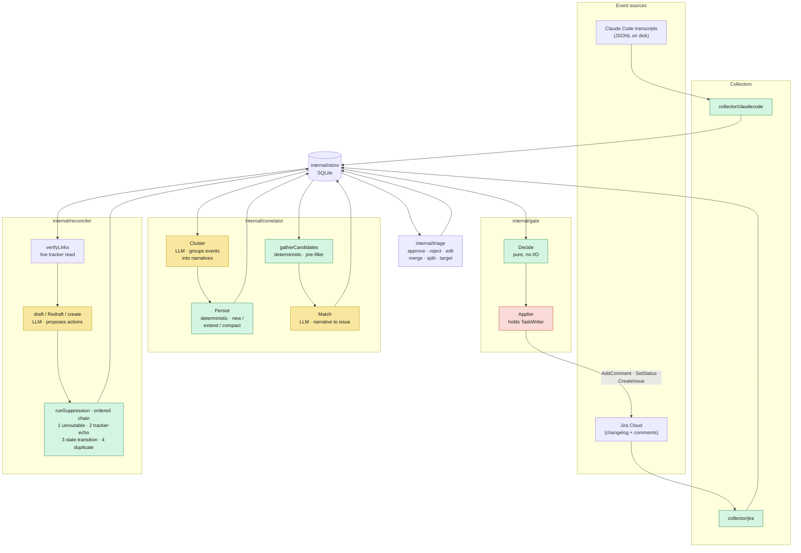
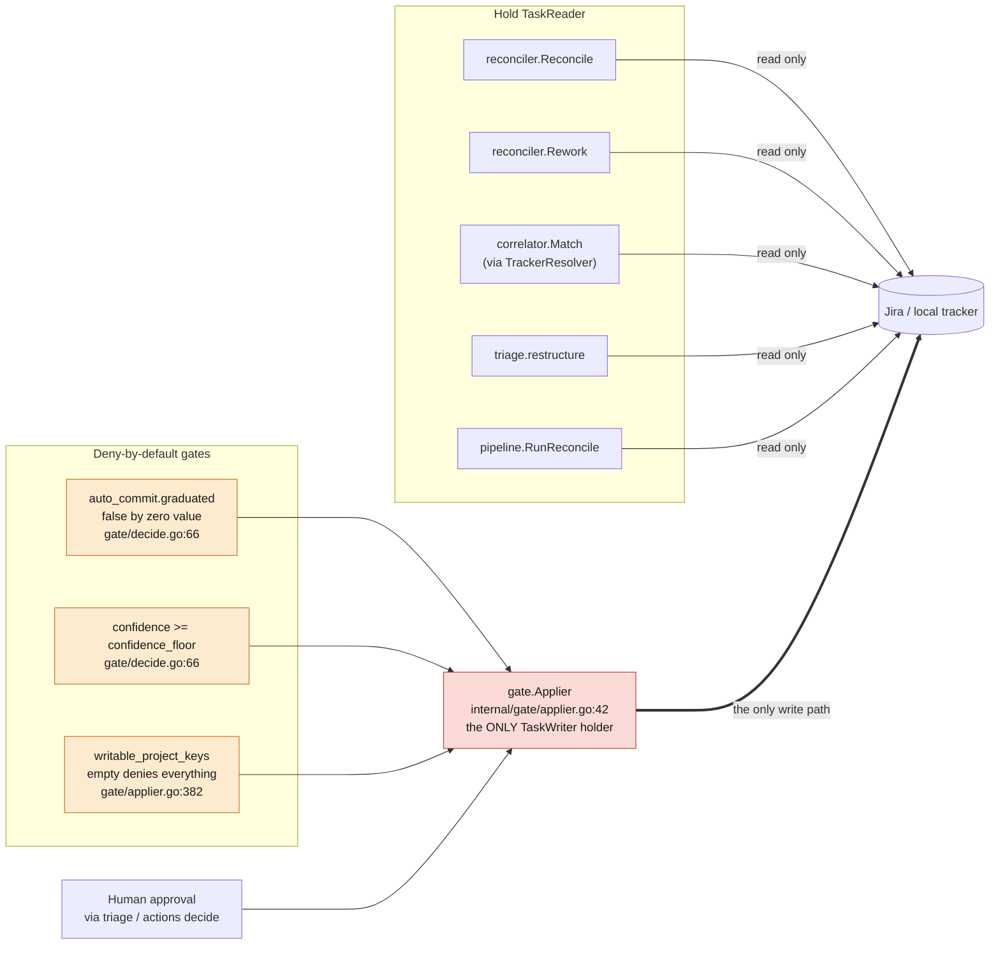
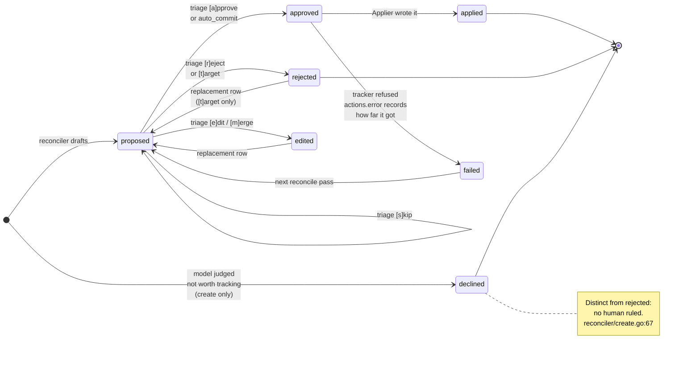
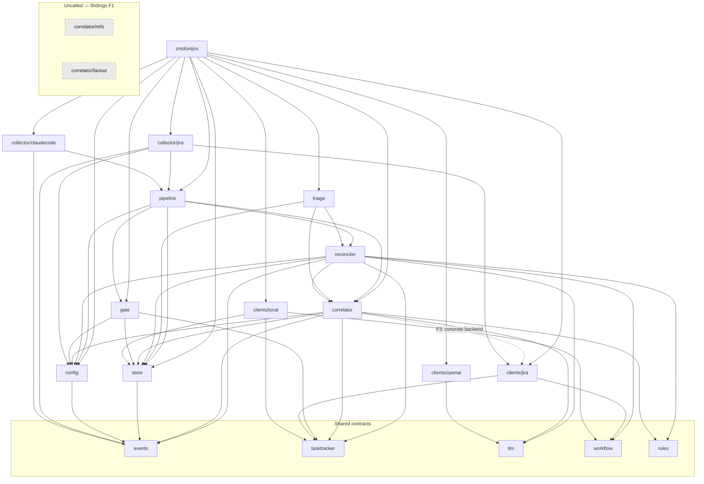

# unjira's architecture, as built

What is actually here, in the present tense. Phase 1 has shipped; the distiller has not.

This file is a **living doc**, held to the same standard as `README.md` and `docs/design-notes.md`:
if a PR changes the pipeline's shape, a package boundary, the write-authority graph, or the action
lifecycle, it updates the relevant diagram *in that PR*. A diagram that has drifted is worse than no
diagram, because it is trusted.

**Describe, do not narrate.** This is not a changelog — it says what the code is, never what it used
to be or when it changed. `git log` holds the history and `docs/design-notes.md` holds the reasoning;
a "before X, we used to…" paragraph here rots the moment the next change lands and teaches a reader to
distrust the rest.

Companion docs, none of which this duplicates:

- `README.md` — what unjira does and the locked design decisions.
- `docs/architecture-findings.md` — where the current shape falls **short**. Kept separate because a
  description is true until the code changes, while a finding is open until somebody closes it; one
  file holding both is never in a settled state.
- `docs/design-notes.md` — *why* it is shaped this way, as numbered incidents.
- `docs/go-conventions.md` — how the Go is written.
- `CLAUDE.md` — the architecture invariants, stated as rules.

Every claim below cites `file:line` where a reader could reasonably want to check it.

---

## 1. The pipeline as data flow

Deterministic stages are the load-bearing ones — the model never sees an event unless a pure
function put it there. Green is deterministic, yellow is LLM-backed, red holds write authority.

**The store at the centre is the point, not clutter.** Every arrow passes through it: no stage hands
another an in-memory value, each reads what the last one committed. That is why a failed pass costs a
retry and nothing else.

These diagrams are drawn for **zoom**, not for a thumbnail — GitHub gives rendered mermaid its own
zoom and pan controls, so the constraint that matters is label *overlap*, never pixel count. Prefer
generous `nodeSpacing`/`rankSpacing` and full labels over abbreviation.

**Seven LLM call sites**, all in two packages — `correlator/correlator.go:229`, `:618`, `:1020`,
`correlator/match.go:556`, `reconciler/draft.go:90`, `:337`, `reconciler/create.go:235`. Nothing
else in the tree calls a model.

Store-mediation is what makes a failed pass cost a retry and nothing else: a stage that dies has
committed either everything or nothing, and the next pass picks up from the persisted state rather
than from a lost in-memory value.

---

## 2. Write authority

The safety-critical diagram. `TaskReader` and `TaskWriter` are separate interfaces
(`internal/tasktracker/tasktracker.go:81`, `:128`) so that "this code cannot write" is a fact the
compiler checks rather than a claim a comment makes.

**Verified: exactly one `TaskWriter` holder in the tree** — `gate.Applier`. `cmd/unjira/actions.go:186`
resolves one to hand it over, and nothing else names the type outside the interface definition and
doc comments. Every other consumer takes `TaskReader`.

`reconciler/create.go:107` is worth reading as a design statement: it takes no tracker at all, and
its comment says *"the parameter's absence is the guarantee."*

Each gate is independently load-bearing, per `docs/design-notes.md` incident 16 — a gate that
duplicates another is not a gate. Gate 3 answers a different question from gates 1–2: not "is this
action trusted" but "is this project one we may write to at all."

---

## 3. Action lifecycle

Reading the transitions, since some distinctions matter more than an edge label can carry:

- **`declined`** is the model judging work not worth a ticket — creates only, and **distinct from
  `rejected`, which is a human's ruling** (`reconciler/create.go:67`). Conflating them would teach
  slice 7's distiller that unjira's own taste and a reviewer's are the same signal.
- **`reject / retarget`** are both recorded `rejected`, but only retarget produces a replacement row:
  the old action named the wrong issue, so it was ruled against rather than reworded
  (`triage/restructure.go:364`).
- **`edit / merge`** supersede with a replacement row and status `edited`.
- **`failed`** carries `actions.error` recording how far a multi-hop route got. **Retry is simply the
  next reconcile pass** — there is no separate retry path.
- **`skip`** leaves the action `proposed` for the next session.

**The seven `actions.status` values are named constants in one place.** `internal/store/actionstatus.go`
declares `StatusProposed`, `StatusApproved`, `StatusEdited`, `StatusRejected`, `StatusApplied`,
`StatusFailed`, `StatusDeclined` — `store` rather than `reconciler`, `triage`, or `gate` (each of
which writes or compares at least one) because `store` is the only package none of the other three
import, so every writer reaches the constants through an import edge it already has. `gate` and
`triage` reference them as `store.StatusX`; `reconciler.StatusProposed` and
`reconciler.StatusDeclined` are aliases to the same constants, kept because this package already
spells both unqualified in several places, including its own tests. No `actions.status` comparison
or assignment anywhere in `internal/` or `cmd/` uses a bare string literal for one of these seven
values. `"open"`/`"split"` (`store.StatusOpen`/`store.StatusSplit`) are a separate, narrative-level
enum and are declared the same way, in `internal/store/narrativestatus.go`.

---

## 4. Package dependency graph

Acyclic (it compiles). Direction is downward; no `internal/` package imports `cmd/`.

---

## 5. Patterns and principles

Read against SOLID and the pattern vocabulary of Gamma et al. and Bass's *Software Architecture in
Practice*. Every row below was checked against the source, not inferred from a doc comment.

The **deliberate non-applications** below matter as much as the conformances: without a record, a
future reader sees a `switch` where a registry "should" be and changes it without knowing the
trade-off was weighed.

### Where the code already conforms

| Principle / pattern | Where | Evidence |
|---|---|---|
| **Interface Segregation** | every interface in `internal/` | **14 interfaces, all 1–3 methods.** `llm.Client` has one. No fat interface anywhere in the tree. |
| **Dependency Inversion, used for safety** | `tasktracker.TaskReader` / `TaskWriter` | The split exists so "this code cannot write" is a compile error. `reconciler/create.go:107` states it outright: *"this takes no TaskReader — the parameter's absence is the guarantee."* DIP for a security property, not for testability. |
| **Liskov substitution** | `clients/jira` vs `clients/local` | Both satisfy the full `TaskTracker` *and* `workflow.GraphProvider`, asserted at compile time (`_ workflow.GraphProvider = (*Tracker)(nil)`, `local/local.go:36`, `jira/tracker.go:27`). `local`'s graph is static, `jira`'s is mined — same postcondition, no weakening. |
| **Strategy + registry (OCP)** | `cmd/unjira/main.go:59` | Adding a collector is one map entry. Verified: **nothing downstream switches on collector name.** |
| **Adapter** | `internal/clients/*` | Thin facades, business logic one layer up. `clients/local` adapts two SQLite tables to a tracker interface. |
| **Bass: "limit access to critical resources"** | `gate.Applier` | Exactly one `TaskWriter` holder in the tree, behind three independent gates. The tactic implemented as a type constraint rather than a review convention. |
| **Command + audit log** | the `actions` table | Each action is a reified request carrying its own lifecycle and `actions.error`. Retry is re-execution on the next pass, not a separate path. |
| **Chain of Responsibility** | `reconciler.suppressionChain` | Four filters, uniform contract, order asserted as data — see below. |
| **Marker interface for optional capability** | `pipeline.StatusHistorySource`, `workflow.GraphProvider` | Type-asserted, not name-checked. `status_history.go:25-34` explains why the marker returns nothing: a `bool` would let the assertion and the value disagree. |

### Chain of Responsibility, and why the chain is data

`internal/reconciler/filters.go` defines `filterContext`, `suppressionFilter`, and
`suppressionChain`; `runSuppression` walks it, feeding each filter what survived the last. All four
filters share one context type and one return contract, so the chain is a slice rather than four
hand-wired calls.

**The order is asserted, not implied** — `TestSuppressionChain_OrderIsExplicitAndLoadBearing` reads it
directly, and a dropped filter fails three tests including the tracker-echo end-to-end case. That is
the property worth having: a reordering is a test failure with a reason attached, where a sequence of
statements would make it a diff that reads as harmless. `docs/design-notes.md` incident 25 records the
reasoning, including the ordering bug (incident 22) that a hand-wired chain permitted.

One asymmetry is deliberate and documented on the type: three filters are pure, `suppressDuplicates`
needs the store to ask whether another narrative already holds an open proposal. Uniformity costs it a
parameter the others ignore, which is cheaper than an uncomposable chain.

### Patterns considered and not currently applied

These are places a pattern would plausibly fit and where the case for adopting it is not yet strong
enough to act on. **None of them are settled against** — each is recorded with the condition that
would change the answer, so a later reader can check whether that condition now holds rather than
re-deriving the analysis from scratch. Where a note says "revisit when X," X arriving is a reason to
act, not a reason to argue.

**A registry for tracker backends.** Today it is a `switch` (`cmd/unjira/main.go:97`) with five
backend-aware sites, all confined to `cmd` and `config`. That is an asymmetry with the collector
registry, and a defensible one at two backends — one of which exists only for tests. Registries start
paying off around three variants. *Revisit when a third tracker lands*, or if backend-aware sites
begin appearing outside `cmd`/`config`.

**A Repository interface over `internal/store`.** The package holds two responsibilities — unjira's own
records (events, narratives, actions, cursors, `pipeline_lock`) and the local tasktracker backend's
mimicked issue store (`local_issues`/`local_issue_comments`, `localissues.go`) — sharing one `*Store`
handle and one `Open` because both need exactly one SQLite file, not because they share query logic.
That split is expressed at the file level (each concern has its own file; §4's dependency graph is
unaffected, since both stay inside `internal/store`), not via an interface: with one implementation and
no second datastore in prospect, an interface would add indirection without inversion. *Revisit if a
second store implementation becomes real* — an in-memory store for tests, or a non-SQLite backend.

**`correlator.Stats` as a Visitor.** It is a plain accumulator with `Add`/`AddUsage`
(`correlator.go:131`, `:144`), and the pattern name would not change the code. *Revisit if traversal
logic accumulates* — several stats types over one event walk, say, where double-dispatch would earn
its keep.

**A common "external system" interface over `Collector` and `TaskTracker`.** These sit at opposite ends
of the dependency graph: a collector is a *source* unjira reads without judgment, a tracker is a *sink*
only `gate.Applier` may write. Unifying them would put read and write authority behind one type, which
is the property §2 rests on — so this one carries a real cost, not just insufficient benefit. If a
future system is genuinely both (a tracker unjira both collects from and writes to — Jira already is,
via two separate seams), the shape worth reaching for is probably two interfaces on one adapter, not
one interface over both.

## Properties that hold

The load-bearing guarantees, each checkable against the tree. A change that breaks one of these is a
change to unjira's architecture, not a refactor — treat it accordingly.

- **Write authority is singular.** One `TaskWriter` holder, three independent gates, deny-by-default
  at every one. The `TaskReader`/`TaskWriter` split makes this a compile error rather than a
  convention.
- **Collectors are dumb.** No collector imports `tasktracker`. `collector/jira` imports
  `clients/jira`, which is it reading *its own source* — allowed, and not judgment.
- **No layering inversions.** Nothing in `internal/` imports `cmd/`. No import cycles.
- **The store is the only channel between stages**, which is what makes per-narrative failure
  isolation work.
- **Deterministic filters run before and after the model** in the reconciler, in an order asserted by
  a test rather than implied by statement sequence.

Where the current shape falls short of these, or of good practice generally, is
`docs/architecture-findings.md`.
