# Port unjira from Python to Go

Status: approved. Scope: this spec covers porting the existing phase-0 pieces (events, store,
config, Jira facade, workflow mining, dev seed/reset, the `claude_code` collector, the deterministic
correlator primitives) to Go, plus the build/CI/release scaffolding needed to build and test that
port. It does **not** cover the phase-1 LLM correlator/reconciler/review-queue/applier vertical —
that is a separate, later brainstorm, once this port is merged.

## Why Go, and why now

unjira started in Python. That was reasonable for phase 0 (mostly library integration: a Jira
client, deterministic parsing/regex logic, SQLite). But unjira's actual deployment profile —
"executed a lot, across many environments, distributed to the internet at large, every user a
developer of some kind" — is exactly the profile that favors a single static binary over a
language requiring an interpreter/venv on the target machine (the same reason tools like `kubectl`,
`gh`, and `terraform` are compiled binaries, not scripts).

The deciding factor was timing, not just fit: phase 0 (built, ~43 tests) is small and mechanical —
parsing, SQL, HTTP wrapping. Phase 1 (the LLM correlator/reconciler, review queue, applier — the
hard, judgment-heavy part) is **unwritten in either language**. Porting the easy part now avoids
porting the hard part later. The Go ecosystem was verified, not assumed, before committing:
`andygrunwald/go-jira` supports the same enhanced-JQL (`SearchV2JQL`) Cloud endpoint the Python
facade relies on; AWS ships an official, first-party Bedrock Go SDK with Converse API support;
`modernc.org/sqlite` is a cgo-free SQLite driver that produces genuinely static binaries.

LiteLLM (unjira's planned path to Bedrock Claude, matching prod usage) stays fully supported: the
prod deployment is a **LiteLLM proxy** (confirmed by inspecting this very session's own
`ANTHROPIC_BASE_URL` env var, which is the standard shape of "client pointed at a gateway"), and a
proxy speaks plain OpenAI-shaped REST/JSON — a Go client reaches it with `net/http`, no SDK
dependency, in either language. This was a hypothesis explicitly confirmed against the running
environment rather than assumed.

## Go conventions

Full conventions (CLI framework, interface/constructor naming, error handling, testing style,
fixture builders, linting, package layout, build tooling, module path) are codified in
`docs/go-conventions.md`, a standalone, self-contained document — not duplicated here. Read it
before writing any Go code for this port. Highlights relevant to this spec:

- CLI: `github.com/alecthomas/kong` (gives DI via bind/provider, which flag-only libraries lack).
- Testing: `github.com/stretchr/testify` + `github.com/google/go-cmp`, plus fluent
  AssertJ-style domain assertion helpers and fixture builders (own `testutil` package) — a
  deliberate choice, reasoned through explicitly rather than defaulting to stdlib-only.
- Errors: stdlib `fmt.Errorf("...: %w", err)` wrapping at every layer boundary; never swallow.
- Build: Earthfile via earthbuild; `golangci-lint` v2 with an explicit, individually-justified
  disable list.
- Module path: `github.com/jcogilvie/unjira`.

## Package layout

```
unjira/
  cmd/unjira/main.go        Kong-based entrypoint; cli struct, subcommands
  internal/
    events/                  Event struct, ExtractTicketKeys, IsSentinelKey
    store/                   SQLite schema + access (modernc.org/sqlite, database/sql)
    config/                  config file + env loading
    clients/
      jira/                    facade over go-jira (reads + gated writes)
      # future: litellm/, github/, slack/ — same shape, added as those integrations land
    collector/
      claudecode/             JSONL transcript scanner, ExcludeCwds
    correlator/
      refs/                   fully-qualified range-aware ref parsing
      fanout/                 env-mirror clustering
    workflow/                 WorkflowGraph, BFS path planning (depends on clients/jira)
    devtools/                 dev seed/reset test-data lifecycle (depends on clients/jira)
    pipeline/
      collect/                run enabled collectors, persist events
      digest/                 phase-0 digest
    testutil/                fluent fixture builders + domain assertion helpers (test-only)
  go.mod / go.sum
  Earthfile
  .golangci.yml
```

Rationale for two placements worth calling out explicitly (both decided during brainstorming,
not defaults): `clients/<system>` is the umbrella for every remote-system integration
(`clients/jira` now; `clients/litellm`, `clients/github`, `clients/slack` as those land) — clients
are thin facades with no unjira business logic inside. `workflow/` and `devtools/` are *not*
inside `clients/jira/` even though both depend on it — they are logic layered on top of the
client (graph mining, test-data lifecycle), not the client itself.



## Module-by-module port mapping

| Python (phase 0) | Go equivalent | Notes |
|---|---|---|
| `events.py` | `internal/events` | `Event` struct w/ JSON tags; regex + sentinel logic ports directly |
| `store.py` | `internal/store` | Same SQLite DDL, unchanged; `database/sql` + `modernc.org/sqlite` |
| `config.py` | `internal/config` | Plain struct + JSON unmarshal + manual defaulting; no Pydantic-equivalent needed |
| `jira/client.py` | `internal/clients/jira` | Facade over `go-jira`; same read/write split, same "authorization lives in the pipeline" invariant |
| `jira/workflow.py` | `internal/workflow` | BFS path-finding ports directly; `Counter[tuple]` → `map[edge]int`; depends on `clients/jira` |
| `collectors/claude_code.py` | `internal/collector/claudecode` | JSONL scan via `encoding/json`; `exclude_cwds` boundary check via `filepath` |
| `correlator/refs.py` | `internal/correlator/refs` | Regex + range expansion port directly; `ValueError` → returned `error` |
| `correlator/fanout.py` | `internal/correlator/fanout` | Same region-fold regexes; struct-based types |
| `pipeline/collect.py` | `internal/pipeline/collect` | Registry becomes `map[string]func() Collector` |
| `pipeline/digest.py` | `internal/pipeline/digest` | Same grouping logic |
| `cli.py` | `cmd/unjira/main.go` + per-command files | Kong subcommands: `collect`, `digest`, `status`, `dev seed/reset/workflow` |
| `devtools.py` | `internal/devtools` | Depends on `clients/jira`; not folded into the client package |

## Testing strategy

Behavioral parity, proven by tests — not a redesign, not a rewrite of logic. For each Python test
file, write the Go equivalent test first (red, using the fixture-builder/testify conventions),
then port the implementation it exercises (green) — same TDD discipline as phase 0.

- `test_jira_client.py` → Go equivalent mocks whatever `go-jira` exposes for transport injection
  (likely an `http.Client`/`http.RoundTripper` swap — confirm the exact seam once writing this
  file, don't guess now).
- `tests/live/test_live_jira.py` → a Go test gated by an env-var check (same `UNJIRA_LIVE=1`
  convention), run separately from the unit suite.
- No new behavior, no scope creep. If something in the Python code is found to be wrong during
  the port, that is a separate follow-up, not folded into this change — otherwise there is no way
  to tell later whether the port preserved behavior or silently changed it.
- Definition of done: `earthly +reviewable` green (lint + full suite), plus a manual side-by-side
  of `unjira digest`/`unjira status` output against the old Python CLI on the same local
  `data/unjira.db` (schema/shape is unchanged; only the driver changed).

## Build, CI, and release

**Build**: Earthfile — `+go-build` (native), `+go-multiplatform-build` (darwin/amd64,
darwin/arm64, linux/amd64, linux/arm64; `CGO_ENABLED=0` for genuinely static binaries), `+go-test`,
`+go-lint`, `+go-modules-tidy`, `+reviewable` as the pre-PR gate.

**CI** — a single `ci.yml`, triggered on push to `main` and on every pull request. All five jobs
below are **required status checks** — nothing is gated behind manual `workflow_dispatch`, since
GitHub Actions minutes are free for public repositories (verified against GitHub's own billing
docs before deciding this, not assumed) and this is a new codebase that benefits from running
everything on every PR:

- `lint` — `earthly +lint` (golangci-lint v2)
- `unit-tests` — `earthly +test`
- `codeql` — Go static analysis, SARIF → Security tab
- `trivy-scan-fs` — filesystem vulnerability scan, SARIF → Security tab
- `integration` — live test against `unjira.atlassian.net`, using the **existing** repo secrets
  (`UNJIRA_CI_EMAIL`/`UNJIRA_CI_TOKEN`, already present from the Python-era CI). Gated by a
  GitHub **Environment with required reviewers**: same-repo PRs (the maintainer's own) run
  immediately; fork PRs pause until a maintainer approves the run in the Environments tab, since
  fork PRs don't get repo secrets by default on a public repository and this job needs them.

DEVSBX is explicitly **not** part of CI — it is the maintainer's local/manual dev-loop sandbox
(personal token, `unjira.config.json`, run by hand). `unjira.atlassian.net` is the CI-automated
live target. Two sandboxes, two different testing modes, already resourced — no new credential
provisioning needed for this spec.

**Release**: `tag.yml` (`workflow_dispatch`, version input) creates a git tag →
`release.yml` (triggered by the tag) runs `earthly +multiplatform-build --RELEASE_ARTIFACTS=true`
→ `softprops/action-gh-release` attaches `<binary>_<os>_<arch>.tar.gz` + `.sha256` per platform to
a GitHub Release.



Branch protection on `main` must list all five CI jobs as required status checks — otherwise
"wouldn't want to merge without them" isn't actually enforced by GitHub, just by convention.

## Repo transition

- The Python `src/unjira/`, `tests/`, `pyproject.toml`, `uv.lock`, `.venv` etc. are **deleted**
  once the Go port reaches parity and merges. No dual-language repo, no kept-around legacy path.
- `config/unjira.example.json`, `.env.example`, `rules/*.md`, and the existing `docs/*.md`
  (design-notes, go-conventions) are language-agnostic and need no changes.
- `README.md` needs updates: the Quickstart section's `uv`/`pytest` commands become
  `earthly +build`/`go test`; the Layout section's Python tree becomes the Go tree above.
- `CLAUDE.md` needs a rewrite: it is currently entirely Python-specific (`uv run pytest`,
  `from __future__ import annotations`). It becomes a pointer to `docs/go-conventions.md` plus
  the still-true architecture invariants (collectors stay dumb, verification lives in the
  reconciler, etc.) — the Kubernetes-controller framing is unchanged, only the
  "how to work on this codebase" specifics change.
- This port lands as one PR (or a small, tightly-sequenced stack) branched off `main` — not built
  incrementally alongside the Python code in the same tree, to avoid a long-lived, confusing
  half-Python-half-Go intermediate state in git history.

## Explicitly out of scope

- The phase-1 LLM correlator/reconciler, review queue, and applier vertical — separate future
  brainstorm, built directly in Go once this port is merged.
- Release/install *distribution* mechanics beyond attaching binaries to GitHub Releases (a
  Homebrew tap, `go install` support, etc.) — flagged as a future decision, not blocking.
- Any change in behavior versus the Python implementation. This is a port, not a rewrite of
  logic; bugs found along the way are separate follow-ups.
